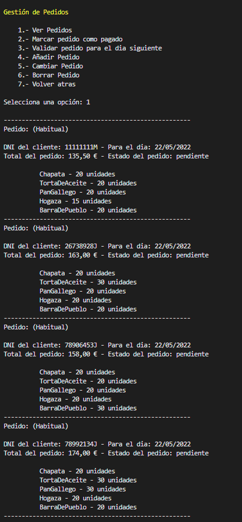
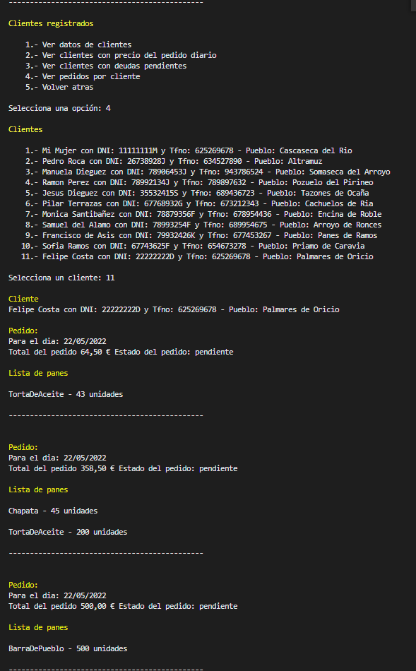
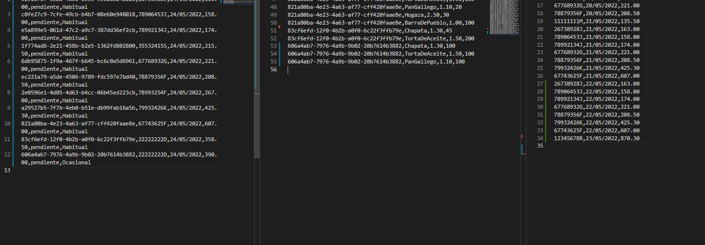

<html>
# PANADERÍA - TRABAJO ENTORNOS

## Contextualización
---
 

>Se nos plantea ayudar a un panadero, asentado en los pirineos, a digitalizar su negocio. Nuestra parte es diseñar y programar una aplicación que le sirva para controlar los cobros de su panadería, para así obtener un control más preciso. Debido a la libertad de implementación, he decido que las necesidades y competencias del programa sean las siguientes:

 

+ Nuestro cliente es un panadero que regenta un obrador enfocado a la panadería. Este se encarga de proveer de pan a las panaderías de los pueblos aledaños. Entre ellos se encuentra el suyo propio, donde está su mujer, quien regenta y se encarga de la venta de pan que hace su marido en una pequeña tienda. Su mujer será considerada por el programa como un cliente más, aunque luego en su casa el dinero vaya al mismo baúl.

 

+ El panadero nos comunica que él se encarga de vender pan al por mayor, por eso tiene unos pedidos fijos, que no suelen variar. Algunos de sus clientes pagan en el día, otros al final de la semana e incluso algunos al final del mes. Debido a las necesidades, la aplicación se ocupa de mantener un registro de quien ha pagado o quien está pendiente de hacerlo. De todas formas, esta aplicación no maneja registros de ganancias, solo gestiona los cobros para saber quien debe dinero y quien no. Si se quisiera llevar a cabo, habría que añadir las funciones necesarias para guardar los ingresos y los gastos, calcularlos y elegir un modo de mostrarlos como gráficos, tablas...

 

## Diseño
---
 

> Para el diseño de esta aplicación de consola he decidido enfocarme en las funcionalidades básicas:

 

 + Gestión de Pedidos
 + Gestión de Clientes
 + Gestión de Finanzas

> Cada una, como su nombre bien indica, atiende a dichas responsabilidades. Además, he querido agregar un funcionamiento automático. Este, comprueba cada día inicia la aplicación, que se renuevan los pedidos para el día siguiente. Para hacerlo comprueba el estado del pedido, si  sin que se pie a no ser que se modifiquen mediante el uso del programa.  

> Considero que el panadero haría uso de la aplicación a diario, por eso esta función es muy útil. Sin embargo, no he considerado que la entrega pueda fallar o que el propio panadero se ponga enfermo. Si el panadero no inicia la aplicación algún día, se perdería información, pero ahora mismo todos los datos son de prueba y de relleno. De ser realidad, se automatizaría el proceso de ejecutar el programa o incluso se podría externalizar la gestión de datos implementando una base de datos, que incluya un trigger que a diario se actualice la base de datos.

 

## Diagramas
---
 

### Casos de uso de negocio
---

 

 

 

 

### Casos de uso de sistema
---

 

 

 

 

### Diagrama de actividad
---

 

 

 

 

### Diagrama de estado
---

 

 

 

 

### Diagrama de secuencia
---

 

 

 

 

### Diagrama de clase de modelos de negocio
---

 

 

 

 

### Diagrama de clases de arquitectura
---

 

 

 

## Capturas de ejecución
---

 

### Menu Principal
---

 

 

 

### Menu Gestión de Pedidos
---

 

 

 

### Menu Gestión de Clientes
---

 

 

 

### Menu Gestión de Finanzas
---

 

 

 

### Ver Pedidos en Gestion de Pedidos
---

 

 

 

### Ver Pedidos Por Cliente en Gestión de Clientes
---

 

 

 

### Liquidar Deudas de Gestión de Finanzas
---

 

 

 

 

### Prueba de actualización automática de pedidos y deudas - Antes
---

 

 

 

 

### Prueba de actualización automática de pedidos y deudas - Después
---

 

 

 

## Problemas
---
> Durante el desarrollo de este programa me ha ido tocado resolver diferentes problemas para lograr un correcto funcionamiento del mismo:

 

+ >Para guardar un pedido nuevo no ha sido nada sencillo:
   + Primero guardar la lista de panes y sus cantidades, para ello he utilizado un Diccionario, un bucle y luego claro la transformación del diccionario a una lista que pudiera luego tratar para guardar en un CSV exclusivo de este tipo de Objeto (PanesPedido).
   + Luego, después de tener el programa listo, he decidido añadir algo que me parecía fundamental, de lo que no me di cuenta hasta haberlo terminado. Con esto me refiero a hacer dos tipos de pedidos: (Habitual y Ocasional).
   + Finalmente tratar toda esta información, como ya he dicho, con dos tipos de Objetos (Pedido y PanesPedido) y con sus respectivos Repositorios. Luego el programa se encarga de ordenar el puzzle y mostrar la información de varias formas diferentes.

 

+ >Luego quiero resaltar una función que he implementado. Ha sido más que un problema, una forma de darle sentido a mi programa. Este, en mi opinión, no es un programa cien por cien completo, aun así me siento orgulloso de haber improvisado y lograr algo así. Me estoy refiriendo al proceso automático que cada día que se inicia el programa este comprueba todos los pedidos y en función de si son Habituales u Ocasionales los trata. Con él me aseguro de mantener siempre mis cuentas al día y bien almacenadas, lo que me lleva a la siguiente resolución de problemas.
+ >La última parte mi programa ha sido programar el funcionamiento de deudas. A pesar de ser el objetivo principal del programa, yo me centre en hacer funcionar la gestión de pedidos y clientes para luego empezar con las finanzas. Al igual que con el resto de información, resolví mi problema, creando un modelo (Objeto Deudas) así como sus repositorios y métodos de captura de información. Aquí se guarda un registro del dinero que se le debe al panadero.

 

## Conclusiones
>En general me ha sido más sencillo realizar este programa debido a la práctica con los trabajos anteriores, de ahí que también me haya complicado un poco más en su desarrollo. 

>Quiero resaltar que al realizar este programa he añadido ciertas cosas que no conocía como:
+ La utilización de números random de identificación (Guid).
+ Crear un constructor en tu clase vista para que así el programa entienda que estamos en Europa y reconozca el símbolo del euro.
+ También resaltar que he usado el Objeto Decimal en vez de un double o un float. Por un tiempo me volví loco intentando parsear de string a Decimal. Luego comprendí que se trataba de la necesidad de incluir diferentes aspectos. Él parseo si, pero también algo relacionado con la cultura, para que cuando se escribiera en el CSV el número Decimal, la separación de los decimales, en vez de ir con una coma, fueran con punto.
> Para terminar decir, que el programa podría continuar incluyendo, como ya he dicho, funciones de registro de gastos como (luz, gasolina, proveedores), para ser una aplicación profesional.   
> También pienso que nunca haría una aplicación de consola si se me pidiera digitalizar un negocio. En tal caso primero haría una aplicación móvil y si no cuanto menos una de escritorio.   

 

### realizado por:
## Gonzalo Alvarez Pablos

</html>